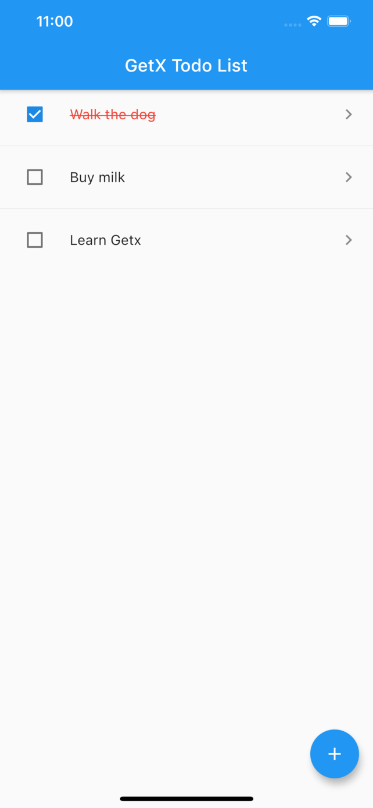
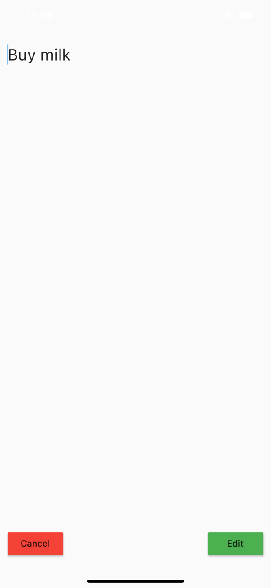
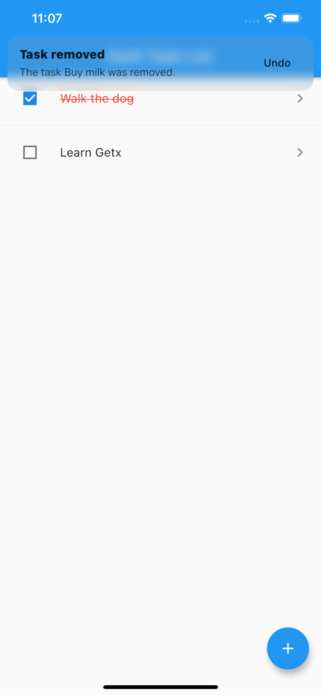

# getx_todo

https://github.com/carnevalli/getx_todo_app_tutorial

## skinny flutter repo

No `ios` and `android` folders. Use `flutter create .`.

## screenshots

| HomeScreen                                | Edit                          | Delete                                           |
| ----------------------------------------- | ----------------------------- | ------------------------------------------------ |
|  |  |  |
